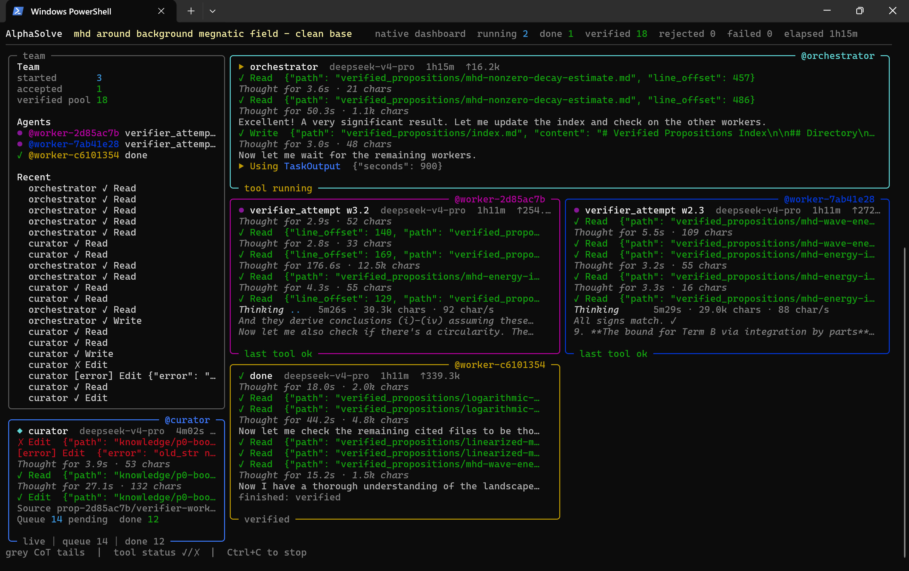

# AlphaSolve

[中文](README.md) | English

> A multi-agent proof workbench for mathematical research: AlphaSolve lets LLMs carry out long-running research, supports human-in-the-loop collaboration and resumable work, and produces **natural-language** proofs.

Put a `problem.md` file in an empty folder and run `alphasolve`. AlphaSolve will keep exploring until the problem is solved. You can also manually add propositions to `verified_propositions`, or add reference papers and notes to `knowledge/references` (Markdown format required) to guide and intervene in AlphaSolve's later behavior.

<p align="center">
  
</p>

## What Is This?

AlphaSolve is an automated mathematical theorem-proving system based on large language models (LLMs). It follows a research workflow designed for long-running exploration: the Orchestrator plans directions, multiple Workers try proofs in parallel, Verifiers review proofs from different angles and suppress hallucinations, Revisers repair failed proofs, and the Curator organizes knowledge produced during exploration into `workspace/knowledge/` for later reuse.

Without manual intervention, AlphaSolve can run autonomously for dozens of hours. It is especially suited to mathematical problems that require long exploration, repeated trial and error, accumulation of intermediate lemmas, and preservation of failed attempts. If hallucinated content passes through the Verifier and appears in `verified_propositions`, a human can delete it manually and restart AlphaSolve to continue the research.

## Quick Start

> This section is written for mathematicians and math students without programming experience. Follow the steps below one by one.

### Step 1: Get a DeepSeek API Key and Set It as an Environment Variable

AlphaSolve needs to call an LLM for reasoning. **DeepSeek** is recommended.

1. Open https://platform.deepseek.com/ in your browser and create an account.
2. Go to the "API Keys" page, click **Create API Key**, and copy the generated key. It should look like `sk-xxxxxxxxxxxxxxxx`. **The key is shown only once, so save it immediately.**

Now set the key as a permanent environment variable. You only need to do this once.

On Windows:

1. Press `Win`, type **environment**, and open **Edit the system environment variables**.
2. Click **Environment Variables...**.
3. Under **System variables**, click **New...**.
4. Set **Variable name** to `DEEPSEEK_API_KEY`.
5. Paste your key into **Variable value**.
6. Click **OK** on all windows to save.

On macOS or Linux, add this to your shell profile:

```bash
export DEEPSEEK_API_KEY=your_key
```

### Step 2: Install AlphaSolve

On Windows, open Command Prompt (`Win + R`, type `cmd`, press Enter), then paste and run:

```bash
curl -fsSL https://raw.githubusercontent.com/tanzcoding/AlphaSolve/main/install.bat -o install.bat && install.bat
```

On macOS or Linux:

```bash
curl -fsSL https://raw.githubusercontent.com/tanzcoding/AlphaSolve/main/install.sh | sh
```

The script automatically installs uv, downloads AlphaSolve, and installs dependencies. You do not need to install Python separately. After installation, the `alphasolve` command is available globally.

### Step 3: Write a Math Problem

1. Create a new empty folder anywhere you like, for example `my_problem` on your desktop.
2. Enter that folder and create a text file named `problem.md`. Make sure the extension is `.md`, not `.txt`.
3. Open `problem.md` with a text editor and write the theorem or problem you want to prove.

Describe the problem clearly, including complete assumptions and conclusions. Avoid vague requests such as "generalize this result." LaTeX formulas are recommended. For example:

```text
Prove that for every positive integer n, the sum of the cubes of the first n
positive integers equals the square of the sum of the first n positive integers:
$$\sum_{k=1}^n k^3 = \left(\sum_{k=1}^n k\right)^2$$
```

Save the file when you are done.

### Step 4: Run

1. Right-click an empty area inside the `my_problem` folder and choose **Open in Terminal**.
2. Run:

```bash
alphasolve
```

You will see a live dashboard showing AlphaSolve's current work. Keep the terminal open and let it run. To stop midway, close the terminal window or press `Ctrl+C`.

### Step 5: Check Results

After the run ends, the current folder may contain:

- **`solution.md`** - the complete proof if the problem was solved
- **`workspace/verified_propositions/`** - all verified intermediate propositions
- **`workspace/knowledge/`** - mathematical knowledge and research notes accumulated during the run

If you stop midway or the run ends, intermediate results are preserved. Running `alphasolve` again in the same folder automatically resumes the previous work.

### Next Steps

- If something goes wrong, run with `--debug` (`alphasolve --debug`) to generate detailed diagnostic logs under `logs/`.
- To adjust proof strategy, see [Usage](#usage).
- To switch models, see [Configuration](#configuration).

## System Architecture

```text
CLI (alphasolve)
    └── AlphaSolve.run()                        [workflow.py]
            ├── Wolfram kernel detection
            ├── ExecutionGateway (Python / Wolfram process pools)
            ├── CuratorQueue (background knowledge-management agent)
            └── Orchestrator.run()              [orchestrator.py]
                    └── WorkerManager
                            └── Worker x N (threads)  [worker.py]
                                    ├── Generator
                                    ├── Verifier (x verifier_scaling_factor)
                                    ├── Reviser
                                    └── TheoremChecker
```

### Workflow

```text
problem.md
    |
    v
Orchestrator (LLM)
    |  reads verified_propositions/ and knowledge/
    |  calls spawn_worker(hint) / wait()
    |
    +--> Worker
    |        |
    |        +-- Generator      -> creates proposition.md (statement + proof)
    |        +-- Verifier x N   -> independent proof reviews, then LLM synthesis
    |        +-- Reviser        -> repairs based on feedback, up to max_verify_rounds
    |        +-- TheoremChecker -> checks whether the original problem is solved
    |
    v
verified_propositions/   <- verified propositions read by all workers and Orchestrator
    |
    +-- if a proposition solves the original problem -> solution.md
```

### Core Components

| Component | Role |
|------|------|
| **Orchestrator** | Reads workspace state, spawns workers with targeted hints, and calls `wait()` for results. It can call `research_reviewer` to summarize large sets of files. |
| **Worker** | An independent thread that runs the full generate -> verify -> revise pipeline. |
| **Generator** | Proposes new propositions, including conjectures and proofs, then writes them into the worker directory. |
| **Verifier** | Strictly reviews proofs. Multiple Verifier strategies are available and may call subagents. |
| **Reviser** | Repairs propositions according to Verifier feedback and rewrites files in place. |
| **TheoremChecker** | Determines whether a verified proposition, together with its referenced propositions, proves the original problem. |
| **compute subagent** | A computational subagent equipped with `run_python` and `run_wolfram`. |
| **reasoning subagent** | A pure mathematical reasoning subagent without computation tools. |
| **numerical experiment subagent** | Performs bounded search, branch checks, and local numerical experiments. |
| **research_reviewer** | Summarizes `verified_propositions/` and `knowledge/`, compares them with `problem.md`, and suggests research directions. |
| **curator** | A background agent that extracts mathematical knowledge from traces, writes it into `knowledge/`, resolves conflicts, and cross-checks entries. |

## Installation

Using **uv** or pipx is recommended so that `alphasolve` can be run from any directory.

```bash
# Clone the repository
git clone https://github.com/tanzcoding/AlphaSolve.git
cd AlphaSolve

# Option 1: uv (recommended)
uv tool install -e .

# Option 2: pipx
pipx install -e .

# Option 3: pip (development mode)
pip install -e .
```

## Configuration

### API Keys

Set environment variables according to the LLM providers you use:

```bash
export DEEPSEEK_API_KEY=your_key      # DeepSeek
export ARK_API_KEY=your_key           # Volcengine
export MOONSHOT_API_KEY=your_key      # Moonshot / Kimi
export DASHSCOPE_API_KEY=your_key     # Alibaba Cloud DashScope
export LONGCAT_API_KEY=your_key       # LongCat
export PARASAIL_API_KEY=your_key      # Parasail
export OPENROUTER_API_KEY=your_key    # OpenRouter
export MIMO_API_KEY=your_key          # Xiaomi MIMO
```

### Wolfram Engine (Optional)

If the Wolfram kernel is not on the default path, set:

```bash
export WOLFRAM_KERNEL=/path/to/WolframKernel
```

### Choose Models

Edit `src/alphasolve/config/agent_config.py` and change the preset configurations used by each component:

```python
GENERATOR_CONFIG    = {**DEEPSEEK_CONFIG}
VERIFIER_CONFIG     = {**DEEPSEEK_CONFIG}
REVISER_CONFIG      = {**DEEPSEEK_CONFIG}
ORCHESTRATOR_CONFIG = {**DEEPSEEK_PRO_CONFIG}   # Orchestrator uses DeepSeek Pro by default
```

Supported presets: `DEEPSEEK_CONFIG`, `DEEPSEEK_PRO_CONFIG`, `VOLCANO_CONFIG`, `MOONSHOT_CONFIG`, `DASHSCOPE_CONFIG`, `LONGCAT_CONFIG`, `PARASAIL_CONFIG`, `OPENROUTER_CONFIG`, `MIMO_CONFIG`.

Each agent's detailed parameters, including system prompt, tool list, and `max_turns`, are configured in separate YAML files under `src/alphasolve/config/agents/`. The top-level entry point is `src/alphasolve/config/agents.yaml`.

### Key Parameters (`agents.yaml`)

| Parameter | Default | Description |
|------|--------|------|
| `max_verify_rounds` | 6 | Maximum verification-revision rounds for each proposition. |
| `verifier_scaling_factor` | 5 | Number of independent verification attempts per round. |
| `verifier_agents` | `verifier_failure_modes`, `verifier_stepwise` | Verifier list to use. |
| `subagent_max_depth` | 2 | Maximum recursive depth for subagents. |

`CHECK_IS_THEOREM_TIMES` defaults to 5 and is configured in `agent_config.py`. It controls the number of independent theorem-checking attempts.

## Usage

### 1. Prepare a Problem File

Create `problem.md` in any working directory and write your math problem in it. LaTeX is supported.

```bash
mkdir my_problem && cd my_problem
cat > problem.md << 'EOF'
Prove that for every positive integer n, 1 + 2 + ... + n = n(n+1)/2.
EOF
```

Optionally, create `hint.md` to provide solution hints or background knowledge.

### 2. Run

```bash
# Basic run, reading problem.md from the current directory
alphasolve

# Common options
alphasolve --problem ./problem.md --hint ./hint.md

# Adjust concurrency and verification strength
alphasolve --workers 4 --verifier_scaling_factor 3 --max_verify_rounds 4

# Use a custom configuration directory
alphasolve --config ./my_config/

# Skip Wolfram detection to start faster
alphasolve --no_wolfram_prime

# Enable debug logs under logs/
alphasolve --debug

# Disable the live terminal dashboard
alphasolve --no_dashboard

# Local demo mode without LLM API calls
alphasolve --demo
```

### CLI Options

| Option | Default | Description |
|------|--------|------|
| `--problem` | `problem.md` | Path to the problem file. |
| `--hint` | none | Path to the hint file. |
| `--workers` | 4 | Number of concurrent workers. |
| `--config` | built-in config | Custom `agents.yaml` path or directory. |
| `--max_verify_rounds` | from `agents.yaml` | Maximum verification-revision rounds for each proposition. |
| `--verifier_scaling_factor` | from `agents.yaml` | Number of independent verification attempts per round. |
| `--subagent_max_depth` | from `agents.yaml` | Maximum recursive depth for subagents. |
| `--debug` | false | Enables debug logs that record detailed agent behavior traces under `logs/`. |
| `--tool_executor_size` | 4 | Python execution process-pool size. |
| `--no_wolfram_prime` | false | Skips Wolfram detection at startup. |
| `--no_dashboard` | false | Disables the live terminal dashboard. |
| `--demo` | false | Local demo mode without LLM calls. |

### 3. Resume Research

AlphaSolve can continue from an existing workspace. Run `alphasolve` again in the same working directory:

```bash
cd my_problem   # a directory that already has workspace/ and problem.md
alphasolve
```

**Resume mechanism:**

- Verified propositions in `workspace/verified_propositions/` are automatically read by the new Orchestrator and reused as known facts.
- `workspace/knowledge/index.md` is the knowledge-base roadmap. The Orchestrator uses it to decide which topic entries or folders to read.
- New worker directories are named `prop-{hash}` and do not use sequence numbers, so they do not collide with directories from previous runs.

**Manually added propositions:**

Human experts can put key propositions directly into `workspace/verified_propositions/` using standard Markdown and LaTeX. On resume, AlphaSolve treats them as verified propositions and continues exploration from them.

### 4. Inspect Results

After a run, the working directory may contain:

```text
workspace/
    verified_propositions/    # all verified propositions
    knowledge/                # knowledge management output, including index.md and topic files
solution.md                   # final solution, generated when the problem is solved
```

When running with `--debug`, `logs/` also records live behavior traces for each agent:

```text
logs/{run_id}/
    orchestrator.log        # every Orchestrator LLM call and tool use
    curator/                # one file per curator chat session
        20260428_153045.log
    workers/
        worker_{hash}.log   # each worker's full generate -> verify -> revise pipeline
```

## Acknowledgements and Related Work

AlphaSolve's architecture was inspired by:

- [AI Mathematician (AIM)](https://arxiv.org/html/2505.22451v1) and its open-source implementation [Carlos-Mero/AIM](https://github.com/Carlos-Mero/AIM/)
- [kimi-cli](https://github.com/MoonshotAI/kimi-cli), which informed several tool-parameter designs and tool-result formats
