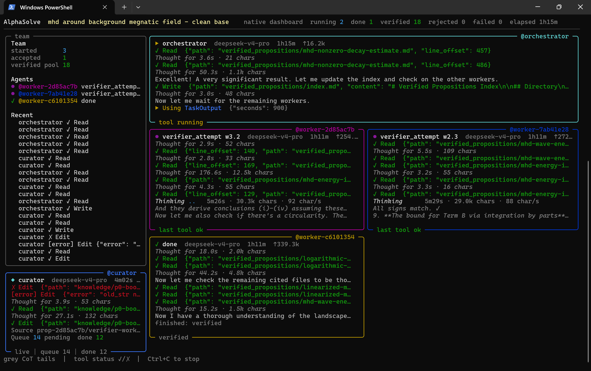

# AlphaSolve

[中文](README.md) | English

> Put a math problem in an empty folder. AlphaSolve explores autonomously until it's solved — producing natural-language proofs, with resumable research and human-in-the-loop collaboration.

<p align="center">
  
</p>

---

## What It Does

AlphaSolve is a multi-agent mathematical theorem-proving system. It organizes LLMs into a long-running research pipeline:

- **Orchestrator** executes research plans, decomposes tracks into bounded tasks, and dispatches Workers into available slots
- **Research Reviewer** reads a read-only DAG projection and worker evidence, returning a multi-track `research_plan` rather than a single worker task
- **Generator** proposes conjectures and proofs; **Verifier** scrutinizes them from different angles; **Reviser** patches flaws
- **TheoremChecker** decides whether verified propositions solve the original problem
- **Task Audit / Process Audit** assess local task delivery and long-horizon research progress separately
- **Curator** is the sole writer of the canonical difficulty DAG and organizes evidence in the background

Without human intervention, AlphaSolve runs autonomously for dozens of hours. It is especially suited to problems requiring repeated trial and error and accumulation of intermediate lemmas.

You can intervene at any point: add propositions to `verified_propositions`, delete hallucinated content, or put papers and notes into `knowledge/references` — AlphaSolve reads these on resume and adjusts its exploration accordingly.

---

## Design Principles

### 1. Separate the Research Tree from the Agent Loop

Mathematical research is naturally tree-shaped: one problem branches into obligations, routes, counterexamples, and local lemmas. A conventional Agent Loop, however, is mostly linear: read context, call a tool, wait for a result, and choose the next action. Asking one loop to maintain the whole research tree makes recent local success look like global progress and encourages repeated attempts on the same route.

AlphaSolve separates the two:

- **Offline memory processing**: `Curator` processes worker events, verified propositions, failure diagnoses, and handoffs, then stores checkable evidence in the canonical difficulty DAG and `knowledge/`.
- **Research-strategy subagent**: `research_reviewer` reads the DAG's read-only semantic projection and recent worker evidence, makes exploration/exploitation, decomposition, reopening, and refutation decisions, and returns a multi-track `research_plan`.
- **Online execution loop**: `Orchestrator` does not maintain the mathematical tree or invent routes. It compiles the research plan into bounded worker tasks and schedules them according to available slots.

This keeps long-term research structure from being trapped in one loop's local context, while leaving room for richer research strategies in the Reviewer.

### 2. Every Action Must Produce Feedback

The most dangerous failure in mathematical search is not a single failed attempt. It is mistaking a plausible proposition for evidence that the overall direction is working. AlphaSolve therefore uses independent auditors rather than allowing the Orchestrator to judge its own progress:

- **Task Audit**: a short-horizon check of whether a Worker delivered the assigned obligation, recording `delivered`, `partial`, `off_target`, or `not_delivered`, together with residual obligations, rejection loci, and salvageable content.
- **Process Audit**: a long-horizon check of whether the portfolio advances the original problem, producing evidence for `ADVANCING`, `STALLED`, or `MISALIGNED` strategy decisions.
- **Worker rejection feedback**: a rejected Worker result is analyzed further: was the target false, the proof gap localized, the task repairable, the execution broken, or the route itself blocked?

The core principle is: **every action — local, strategic, or rejected — must produce enough feedback for the next decision; success/failure as a single bit is not enough.** Auditors are read-only reporters. They do not dispatch Workers or mutate the canonical DAG.

### 3. Subagents as Tools for Replacement and Integration

`research_reviewer`, `compute_subagent`, `reasoning_subagent`, `numerical_experiment_subagent`, and `curator` are connected through tool boundaries instead of being tightly coupled to the Orchestrator. This makes it possible to:

- limit permissions, budgets, recursion depth, and visible data independently;
- replace models or execution backends without changing the core orchestration logic;
- replace a subagent with a hook or plugin later;
- integrate with existing research harnesses, experiment platforms, and evaluation frameworks.

The tool boundary is also a role boundary: subagents return evidence or strategy, the Orchestrator executes, the Curator archives, and the Auditors evaluate.

### 4. Self-Generated Knowledge Is Valuable but Expensive

Worker and subagent traces contain useful route comparisons, discarded approaches, failure diagnoses, and local insights even when they do not become verified propositions. AlphaSolve experiments with extracting this self-generated knowledge, including selected CoT-derived research summaries, into `knowledge/` as navigation information for later Reviewers and Workers.

This material is not a substitute for `verified_propositions`: it may be wrong, duplicated, or stale, and must be used with citations, audits, and subsequent verification. Knowledge extraction, compression, conflict resolution, and context injection also consume substantial tokens and time, so this remains an expensive experimental capability. Future work will optimize summary granularity, incremental updates, and retrieval.

---

## Quick Start

> This section is for mathematicians and math students with no programming experience. Just follow the steps.

### 1. Get an API Key

AlphaSolve calls an LLM for reasoning. **DeepSeek** is recommended (Chinese phone numbers can register directly; new users get free credits).

1. Open https://platform.deepseek.com/ and create an account
2. Go to "API Keys" → **Create API Key** → copy the key (looks like `sk-xxxxxxxxxxxxxxxx`). **The key is shown only once — save it immediately**

Set the key as a permanent environment variable (one-time setup):

On Windows:

3. Press `Win`, type **environment**, open **Edit the system environment variables**
4. Click **Environment Variables...** → under **System variables** click **New...**
5. Variable name: `DEEPSEEK_API_KEY`, Variable value: paste your key
6. Click **OK** on all windows

On macOS/Linux, add to your shell profile:

```bash
export DEEPSEEK_API_KEY=your_key
```

### 2. Install

On Windows, open Command Prompt (`Win + R` → `cmd` → Enter) and paste:

```bash
curl -fsSL https://raw.githubusercontent.com/tanzcoding/AlphaSolve/main/install.bat -o install.bat && install.bat
```

On macOS/Linux:

```bash
curl -fsSL https://raw.githubusercontent.com/tanzcoding/AlphaSolve/main/install.sh | sh
```

The script installs uv, downloads AlphaSolve, and installs dependencies. No separate Python needed. After installation, `alphasolve` is available globally.

### 3. Write a Math Problem

1. Create a new empty folder (e.g. `my_problem` on your desktop)
2. Create a file named `problem.md` inside it (extension `.md`, not `.txt`)
3. Open it with a text editor and write the theorem or problem you want to prove

> Describe the problem completely — all assumptions and conclusions. Avoid vague directions like "generalize X to Y." LaTeX is recommended:

```
Prove that for every positive integer n, the sum of the cubes of the first n
positive integers equals the square of the sum of the first n positive integers:
$$\sum_{k=1}^n k^3 = \left(\sum_{k=1}^n k\right)^2$$
```

4. Save the file

### 4. Run

1. Right-click an empty area in the folder → **Open in Terminal**
2. Type `alphasolve` and press Enter

You'll see a live dashboard showing progress. Keep the terminal open. To stop, close the window or press `Ctrl+C`.

### 5. Check Results

After the run, the folder contains:

| Output | Description |
|--------|-------------|
| `solution.md` | The complete proof (appears when the problem is solved) |
| `workspace/verified_propositions/` | All verified intermediate propositions |
| `workspace/knowledge/` | Accumulated mathematical knowledge and insights |
| `workspace/curation_records/difficulty_dag.json` | Curator-maintained canonical difficulty DAG |
| `workspace/curation_records/research_plans/` | Reviewer research plans and execution records |
| `workspace/progress_audits/` | Task/Process Audit checkpoints and evidence snapshots |

Stopping and running `alphasolve` again in the same folder resumes automatically — verified propositions and the knowledge base are reused.

---

## What Happens During a Run

AlphaSolve's research loop works like a constantly cycling laboratory. The current architecture separates research strategy from execution scheduling:

- `research_reviewer` compares evidence and selects `primary`, `challenger`, and `supporting` tracks with route/tabu constraints; it does not dispatch Workers, write the DAG, or define acceptance rubrics.
- `orchestrator` selects tracks that fit the available worker slots, decomposes them into bounded tasks, and writes auditable rubrics; it does not invent new mathematical routes.
- `curator` maintains the canonical difficulty DAG from checkable evidence; worker handoffs, no-progress streaks, and reviewer observations do not automatically create children or change canonical status.

```text
worker results
      |
      +-- Task Audit: was the assigned obligation delivered?
      +-- Process Audit: is the research portfolio advancing?
               |
               v
       Research Reviewer
               |  research_plan (1–4 tracks)
               v
        Orchestrator
               |  select tracks, decompose bounded tasks, write rubrics
               v
        Worker pool (up to max_workers in parallel)
```

```text
problem.md + verified_propositions + knowledge
      |
      v
+-- Orchestrator --------------------------------------------------------+
|  Collects worker results and audit feedback                             |
|  Calls research_reviewer when strategy is unclear                       |
|  Compiles research_plan tracks into bounded tasks and rubrics           |
|  Does not create or mutate the canonical DAG                            |
+-------------------------------------------------------------------------+
      | RequestResearchPlan
      v
+-- Research Reviewer ----------------------------------------------------+
|  Reads the read-only semantic DAG projection and recent worker evidence  |
|  Returns 1–4 tracks: primary / challenger / supporting                  |
|  Records exploit/explore/refute reasoning and route tabu constraints     |
|  Does not dispatch Workers, write the DAG, or define worker rubrics      |
+-------------------------------------------------------------------------+
      | ExecuteResearchPlan
      v
+-- Worker Pool (default max_workers=2) ----------------------------------+
|  Each selected track becomes one bounded, auditable worker task          |
|                                                                         |
|  Generator --> Verifier x5 --> Reviser (up to 6 rounds)                |
|                                  |                                      |
|                                  v                                      |
|                         TheoremChecker (up to 5 checks)                 |
|                                                                         |
|  Task Audit: local assigned-obligation verdict                           |
|  Process Audit: long-horizon portfolio verdict                          |
+-------------------------------------------------------------------------+
      | verified proposition / worker evidence / audit outcome
      v
+-- Curator (background; sole canonical DAG writer) ----------------------+
|  Archives immutable worker events and verified evidence                  |
|  Maintains difficulty nodes, edges, aliases, and statuses                 |
|  Organizes knowledge but does not choose research strategy                 |
+-------------------------------------------------------------------------+
```

Each Worker runs the full **generate → verify → revise → theorem-check** pipeline. Multiple Workers can run in parallel, but the concurrency limit is only a resource ceiling: the actual number depends on the research plan, dependencies, and available slots.

### Five Verifier Strategies

| Strategy | Review Angle |
|----------|-------------|
| `verifier_format_references` | Checks Statement, reference, and proposition-file protocol |
| `verifier_citation` | Checks whether cited propositions are correctly applied |
| `verifier_failure_modes` | Identifies common reasoning failure patterns |
| `verifier_stepwise` | Examines each step of the proof chain |
| `verifier_premise_chain` | Traces premise chains for hidden unstated assumptions |

Verifier strategies run independently according to the configured strategy list and scaling factor. If any round finds a problem, Reviser fixes it and verification restarts, up to `max_verify_rounds`. This is why a seemingly simple proposition may go through multiple verify-revise rounds — each round brings a different perspective.

### Research Plans and Tracks

When local worker evidence does not determine the next direction, the Orchestrator calls `RequestResearchPlan`. The `research_reviewer` returns a `research_plan` containing one to four tracks:

| Track | Meaning |
|-------|---------|
| `primary` | The best evidence-backed main route |
| `challenger` | An independent route using a different mechanism, testing a key premise, or attacking a parent/ancestor |
| `supporting` | A route that supplies a necessary bridge for the primary track |

The Reviewer chooses research directions, route identities, rationales, and tabu constraints. It does not dispatch Workers or write acceptance rubrics. The Orchestrator uses `ExecuteResearchPlan` to select tracks that fit available slots, decompose them into bounded tasks, and write 3–6 rubric bullets that can be checked against the resulting Statement.

Changing only `method_id` does not create a new mathematical route. A recently attempted `route_label` is tabu by default unless new evidence, a localized repair, or a substantive target change justifies reuse. A `verified` but `off_target` or `partial` result is not automatically progress on the assigned obligation.

### Two Audits and the Canonical DAG

- **Task Audit**: a short-horizon verdict on whether one Worker completed its assigned obligation; it distinguishes `delivered`, `partial`, `off_target`, and `not_delivered`.
- **Process Audit**: a long-horizon verdict on whether the research portfolio advances the original problem; `STALLED` and `MISALIGNED` are strategy evidence, not automatic scheduling commands.
- **Difficulty DAG**: `Curator` is the sole canonical DAG writer. Worker handoffs, no-progress streaks, reviewer observations, and failure records are archived as evidence first; they do not automatically create children, split difficulties, or change node status.

---

## Human-in-the-Loop

AlphaSolve is not just a "press and run" tool. You can intervene at any point:

### Add propositions to `verified_propositions`

Write key propositions in Markdown + LaTeX and place them in `workspace/verified_propositions/`. AlphaSolve treats them as verified on resume and continues from there.

### Delete hallucinated content

If hallucinations slip through the Verifiers into `verified_propositions`, delete them manually and continue running.

### Add references to `knowledge/references`

Put paper summaries, key theorems, or personal notes (Markdown format) into `workspace/knowledge/references/`. Orchestrator and Workers read these to guide subsequent exploration.

### Provide `hint.md`

Create `hint.md` in the problem folder with solution hints or background knowledge. AlphaSolve reads it on startup.

---

## Command-Line Usage

```bash
# Simplest: just have problem.md in the current directory
alphasolve

# Specify problem and hint files
alphasolve --problem ./problem.md --hint ./hint.md

# Adjust concurrency and verification strength (default max_workers=2)
alphasolve --workers 2 --verifier_scaling_factor 3 --max_verify_rounds 4

# Custom agent configuration
alphasolve --config ./my_config/

# List tiers and presets (for understanding model config)
alphasolve --list-tiers
alphasolve --list-presets

# Temporary env var override via --env
alphasolve --env DEEPSEEK_API_KEY=sk-xxx

# Skip Wolfram probe (faster startup)
alphasolve --no_wolfram_prime

# Debug logs (detailed agent traces under logs/)
alphasolve --debug

# Disable live dashboard
alphasolve --no_dashboard

# Interactive Agent REPL (single-agent mode)
alphasolve --agent

# Single-shot Agent mode (non-interactive, prints result)
alphasolve --agent -p "Prove that 1+2+...+n = n(n+1)/2"

# Local demo (no LLM calls)
alphasolve --demo
```

### CLI Options

| Option | Default | Description |
|--------|---------|-------------|
| `--problem` | `problem.md` | Path to the problem file |
| `--hint` | none | Path to hint file (ignored if missing) |
| `--workers` | 2 | Maximum concurrent workers; actual usage depends on the research plan, dependencies, and available slots |
| `--config` | built-in config | Custom agents.yaml path or directory |
| `--max_verify_rounds` | 6 | Max verify-revise rounds per proposition |
| `--verifier_scaling_factor` | 5 | Independent verification attempts per round |
| `--subagent_max_depth` | 1 | Max recursive depth for subagents |
| `--max_orchestrator_restarts` | 50 | Max Orchestrator restarts |
| `--debug` | false | Enable debug logs (detailed agent traces under `logs/`) |
| `--tool_executor_size` | 4 | Python execution process-pool size |
| `--no_wolfram_prime` | false | Skip Wolfram kernel probe at startup |
| `--no_dashboard` | false | Disable live terminal dashboard |
| `--agent` | false | Enter interactive Agent REPL |
| `-p` / `--print` | none | Single-shot Agent execution (requires `--agent`) |
| `--list-tiers` | false | List tier mappings and exit |
| `--list-presets` | false | List presets and exit |
| `--env KEY=VAL` | none | Temporary env var override (repeatable) |
| `--demo` | false | Local demo mode (no LLM calls) |

---

## Configuration

### Model Selection: Tier + Preset System

AlphaSolve uses a **Tier → Preset → Model** three-layer mapping for model configuration, rather than per-agent hardcoding.

**Tiers** are three levels. Each agent declares its tier in its YAML config:

| Tier | Default mapping | Usage |
|------|----------------|-------|
| `cheap` | `deepseek-flash` | Curator, compute subagent — background/computation tasks |
| `balanced` | `deepseek-pro` | Generator, Verifier, Reviser — core reasoning tasks |
| `max` | `qwen-3.7-max` | Orchestrator — needs strongest planning capability |

**Presets** define specific API connection parameters (endpoint, key env var, model name, timeout, etc.). View all presets:

```bash
alphasolve --list-presets
```

Built-in presets include: `deepseek-flash`, `deepseek-pro`, `parasail-deepseek`, `longcat`, `moonshot-kimi`, `volcano-doubao`, `volcano-deepseek`, `dashscope-deepseek`, `mimo`, `openrouter-gemini`, `deepseek-pro-anthropic`, `moonshot-kimi-anthropic`, `qwen-3.7-max`.

### Customizing Tiers and Presets

Create `tiers.yaml` and `presets.yaml` under `~/.alphasolve/` to override built-in configs or add your own presets. Format follows the built-in files at `src/alphasolve/config/tiers.yaml` and `presets.yaml`.

For example, to switch the `balanced` tier to Moonshot Kimi:

```yaml
# ~/.alphasolve/tiers.yaml
cheap: deepseek-flash
balanced: moonshot-kimi
max: qwen-3.7-max
```

User files merge with built-in configs, with user files taking priority.

### API Keys

Set environment variables for the providers you use:

| Env var | Provider |
|---------|----------|
| `DEEPSEEK_API_KEY` | DeepSeek |
| `ARK_API_KEY` | Volcengine (ByteDance) |
| `MOONSHOT_API_KEY` | Moonshot / Kimi |
| `DASHSCOPE_API_KEY` | Alibaba Cloud DashScope |
| `LONGCAT_API_KEY` | LongCat |
| `PARASAIL_API_KEY` | Parasail |
| `OPENROUTER_API_KEY` | OpenRouter |
| `MIMO_API_KEY` | Xiaomi MIMO |

Keys can be provided in three ways (highest priority first):

1. `--env KEY=VAL` command-line flags
2. System environment variables (the table above)
3. `.env` files (project-local `.env` or `~/.alphasolve/.env`)

You can also change the config directory location with the `ALPHASOLVE_CONFIG_DIR` env var (default: `~/.alphasolve/`).

### Wolfram Engine (Optional)

AlphaSolve can call the Wolfram kernel for symbolic computation. Without Wolfram installed, it still runs normally — the `RunWolfram` tool simply reports unavailable.

If the Wolfram kernel is not on the default path:

```bash
export WOLFRAM_KERNEL=/path/to/WolframKernel
```

### Agent Configuration Files

Each agent's system prompt, tool list, max_turns, etc. are configured in individual YAML files:

```
src/alphasolve/solver/config/
    agents.yaml                <- entry point: global params and directories
    agents/
        orchestrator.yaml
        generator.yaml
        verifier.yaml
        verifier_format_references.yaml
        verifier_citation.yaml
        verifier_failure_modes.yaml
        verifier_stepwise.yaml
        verifier_premise_chain.yaml
        verifier_adversarial.yaml  # optional; not enabled in the default verifier_agents list
        reviser.yaml
        theorem_checker.yaml
    subagents/
        compute_subagent.yaml
        reasoning_subagent.yaml
        numerical_experiment_subagent.yaml
        curator.yaml
        research_reviewer.yaml
```

Use `--config` to specify your own config directory (place same-named YAMLs to override built-in configs).

### Key Parameters (`agents.yaml`)

| Parameter | Default | Description |
|-----------|---------|-------------|
| `max_verify_rounds` | 6 | Max verify-revise rounds per proposition |
| `verifier_scaling_factor` | 5 | Independent verification attempts per round |
| `verifier_agents` | `verifier_format_references`, `verifier_citation`, `verifier_failure_modes`, `verifier_stepwise`, `verifier_premise_chain` | Verifier strategies to use |
| `subagent_max_depth` | 1 | Max recursive depth for subagents |
| `max_orchestrator_restarts` | 50 | Max Orchestrator restarts |

`CHECK_IS_THEOREM_TIMES` (default 5) controls independent theorem-checking attempts and is defined in `src/alphasolve/solver/wolfram_state.py`.

---

## System Architecture

```
CLI (alphasolve)
    +-- AlphaSolve.run()                        [solver/app.py]
            +-- Wolfram kernel probe
            +-- ExecutionGateway (Python / Wolfram process pools)
            +-- CuratorQueue (background evidence/DAG writer)
            +-- Orchestrator.run()              [solver/orchestrator.py]
                    +-- Research Reviewer (via SubagentService)
                    |       +-- read-only DAG projection
                    |       +-- multi-track research_plan
                    +-- WorkerManager
                            +-- Worker x N (threads)  [solver/worker.py]
                                    +-- Generator
                                    +-- Verifier x verifier_scaling_factor
                                    +-- Reviser
                                    +-- TheoremChecker
                            +-- Task Audit / Process Audit
```

### Core Components

| Component | Tier | Role |
|-----------|------|------|
| **Orchestrator** | max | Collects audit and Worker evidence, executes research plans, decomposes and dispatches bounded tasks |
| **Research Reviewer** | balanced | Reads the DAG projection and evidence, returns a multi-track `research_plan`; does not dispatch or write the DAG |
| **Generator** | balanced | Proposes conjectures and proof drafts |
| **Verifier** (five strategies) | balanced | Scrutinizes proofs from different angles |
| **Reviser** | balanced | Patches propositions based on Verifier feedback |
| **TheoremChecker** | balanced | Decides whether a verified proposition solves the original problem |
| **Task Audit** | balanced | Judges whether one Worker task was delivered |
| **Process Audit** | balanced | Judges whether cumulative research advances the original problem |
| **Curator** | cheap | Sole writer of the canonical difficulty DAG; organizes evidence and knowledge |
| **compute subagent** | cheap | Equipped with `RunPython` / `RunWolfram` |
| **reasoning subagent** | balanced | Pure mathematical reasoning (no computation tools) |
| **numerical experiment subagent** | cheap | Bounded exploration and local numerical experiments |

---

## Install from Source

```bash
git clone https://github.com/tanzcoding/AlphaSolve.git
cd AlphaSolve

# uv (recommended)
uv tool install -e .

# pipx
pipx install -e .

# pip (development mode)
pip install -e .
```

---

## Debug Logs and Research State

Running with `--debug` records detailed agent behavior traces under `logs/`. Runtime research state and reproducible evidence are stored under the problem folder's `workspace/`:

```
logs/{run_id}/
    token_usage.jsonl       # Token and timing data for each agent/worker turn
    search_tree.jsonl       # Read-only spawn/result attempt observations
    workers/                # Each Worker's full generate -> verify -> revise pipeline
    subagents/              # research_reviewer, compute, and other subagent sessions
    curator/                # Curator sessions

workspace/
    curation_records/
        difficulty_dag.json                 # Curator-owned canonical DAG
        research_plans/plan-*.json          # Reviewer plans and execution status
        events.jsonl                        # Immutable orchestration/curation events
    progress_audits/
        checkpoint-*/audit.md               # Long-horizon Process Audit decisions
        checkpoint-*/evidence.md             # Evidence snapshots for each checkpoint
    progress_audit_outcomes.jsonl           # Settled Worker outcome ledger
    attempt_graph.jsonl                     # Worker attempt and parent provenance
    verified_propositions/                   # Verified mathematical propositions
    knowledge/                               # Navigation knowledge, lessons, and references
```

When inspecting progress, distinguish among:

1. `verified_propositions/`: established mathematical facts;
2. `progress_audits/` and `progress_audit_outcomes.jsonl`: task-delivery and research-progress facts;
3. `curation_records/difficulty_dag.json`: Curator's canonical nodes, edges, and statuses.

Worker handoffs, no-progress streaks, `STALLED` decisions, and reviewer graph observations are evidence first; they do not automatically mutate the canonical DAG.

---

## Acknowledgements and Related Work

- [AI Mathematician (AIM)](https://arxiv.org/html/2505.22451v1) and its open-source implementation [Carlos-Mero/AIM](https://github.com/Carlos-Mero/AIM/)
- [kimi-cli](https://github.com/MoonshotAI/kimi-cli) — informed several tool-parameter designs and tool-result formats