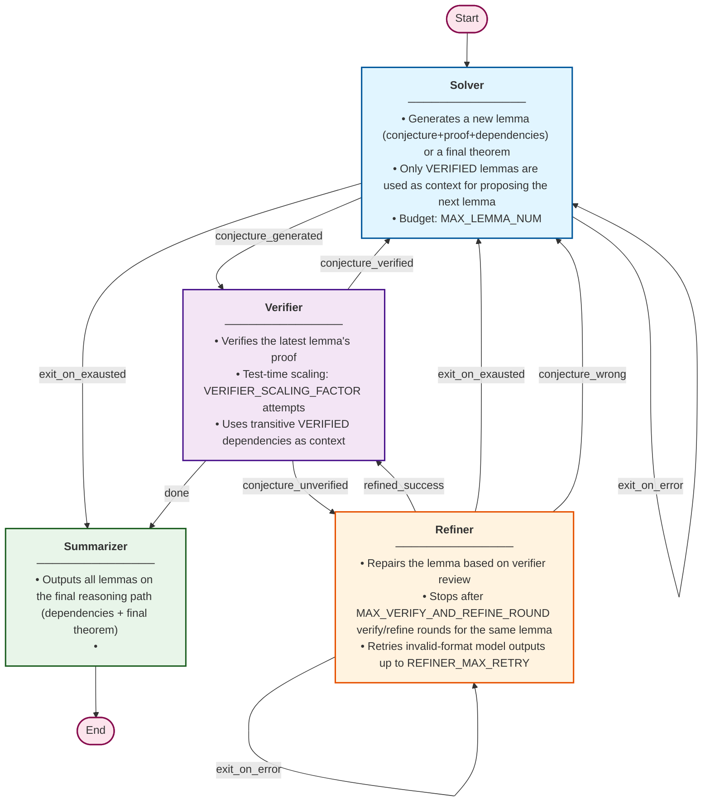

# AlphaSolve

An AI-powered mathematical research system that iterates in a **solve -> verify -> refine** loop to accelerate mathematical problem-solving and theorem discovery.

## Workflow Architecture

AlphaSolve is implemented as a PocketFlow graph. The core nodes are:

1. **Solver** proposes a new lemma (a "conjecture" + proof + dependencies) or a final theorem.
2. **Verifier** stress-tests the proof using **test-time scaling** (multiple independent verification attempts).
3. **Refiner** patches the conjecture/proof using the verifier’s review when verification fails.
4. **Summarizer** emits the final report when a verified theorem is reached (or the system exhausts its budget).

### State machine (as implemented)



## Setup

### 1) Install dependencies

This repo expects an OpenAI-compatible client (via `openai`) and optionally Wolfram Engine.

```bash
pip install -r requirements.txt
```

If you do not have a `requirements.txt` yet, install at least:

```bash
pip install openai wolframclient
```

### 2) Configure API keys

Set the environment variable for the provider you use (examples):

```bash
# DeepSeek
export DEEPSEEK_API_KEY="your_key"

# Volcano (ByteDance Ark)
export ARK_API_KEY="your_key"

# Moonshot
export MOONSHOT_API_KEY="your_key"

# DashScope
export DASHSCOPE_API_KEY="your_key"

# OpenRouter
export OPENROUTER_API_KEY="your_key"

# LongCat
export LONGCAT_API_KEY="your_key"
```

### 3) (Optional) Configure Wolfram Engine

If you enable Wolfram tool usage and did not install the Wolfram kernel under the default installation path, set `WOLFRAM_KERNEL` to your `WolframKernel` executable.

Windows example:

```bash
setx WOLFRAM_KERNEL "C:\\Program Files\\Wolfram Research\\Wolfram Engine\\14.0\\WolframKernel.exe"
```

## Usage

1. Put your problem markdown in [`problems/problem_1.md`](problems/problem_1.md:1) (or update the path in [`main.py`](main.py:1)).
2. (Optional) Put hints in [`hint.md`](hint.md:1) and load them in [`main.py`](main.py:1).
3. Run:

```bash
python main.py
```

Output:

- Prints the final summary to console
- Writes `solution.md` (overwrites) in the project root

## Configuration

### Provider / model selection

Switch the model/provider by editing [`config/agent_config.py`](config/agent_config.py:1).

The active runtime config is embedded into each agent’s config:

- `AlphaSolveConfig.SOLVER_CONFIG`
- `AlphaSolveConfig.VERIFIER_CONFIG`
- `AlphaSolveConfig.REFINER_CONFIG`
- `AlphaSolveConfig.SUMMARIZER_CONFIG`

### Key workflow knobs

Defined in [`config/agent_config.py`](config/agent_config.py:158):

- `MAX_LEMMA_NUM`: maximum number of lemmas Solver may generate
- `VERIFIER_SCALING_FACTOR`: how many independent verification attempts Verifier runs per lemma
- `MAX_VERIFY_AND_REFINE_ROUND`: max verify/refine cycles for a single lemma before it is rejected
- `REFINER_MAX_RETRY`: retries for invalid-format refiner responses
- `MAX_API_RETRY`: full-call retry count when streaming responses are interrupted

## Benchmark

AlphaSolve includes a lightweight benchmark loop.

### Running

1. Put the reference solution in [`standard_solution.md`](standard_solution.md:1)
2. Run:

```bash
python benchmark.py
```

### How it works

The benchmark runs AlphaSolve multiple times on the same problem and scores each run by comparing the produced answer against the reference solution.

See [`benchmark.py`](benchmark.py:1) for the exact evaluation logic and repetition count.
