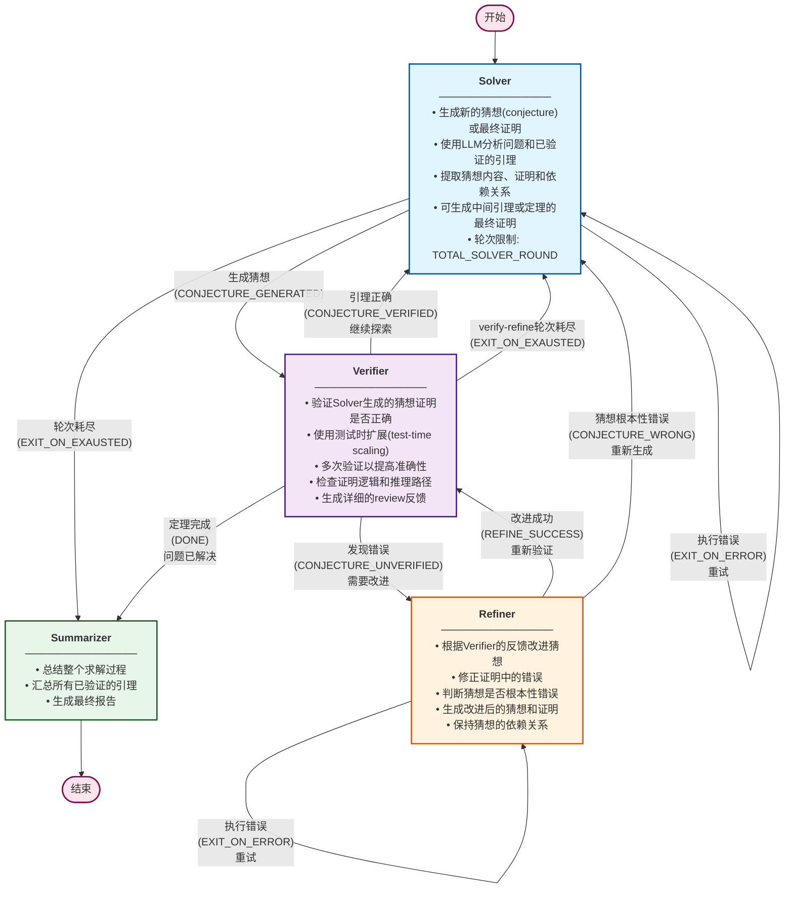

# AlphaSolve

An AI-powered mathematical research system designed to accelerate mathematical problem-solving and theorem discovery.

## Workflow Architecture



### Usage

1. Set up your API keys in the environment variables:
```bash
export DEEPSEEK_API_KEY="your_deepseek_api_key"
# or alternatively for other providers
export MOONSHOT_API_KEY="your_moonshot_api_key"
export ARK_API_KEY="your_ark_api_key"
export DASHSCOPE_API_KEY="your_dashscope_api_key"
export OPENROUTER_API_KEY="your_openrouter_api_key"
```
2. Place your mathematical problem in the [`problem.md`](problem.md) file
3. Run the main solver:
```bash
python main.py
```

### Configuration

AlphaSolve supports multiple LLM providers. You can configure which provider to use by modifying the [`config/agent_config.py`](config/agent_config.py) file:

```python
class AlphaSolveConfig:
    # Available configurations: DEEPSEEK_CONFIG, MOONSHOT_CONFIG, VOLCANO_CONFIG,
    # DASHSCOPE_CONFIG, OPENROUTER_CONFIG, CUSTOM_LLM_CONFIG
    
    # Configure LLM providers for each agent
    REFINER_CONFIG = VOLCANO_CONFIG
    SOLVER_CONFIG = VOLCANO_CONFIG
    VERIFIER_CONFIG = VOLCANO_CONFIG
    SUMMARIZER_CONFIG = VOLCANO_CONFIG
```

Each agent (Solver, Verifier, Refiner, Summarizer) can be configured with a different LLM provider based on your needs.

## Benchmark

### Running Benchmarks

To evaluate AlphaSolve's performance:

1. Place the standard solution in the [`standard_solution.md`](standard_solution.md) file
2. Run the benchmark script:
```bash
python benchmark.py
```

### How Benchmarking Works

The benchmark system executes AlphaSolve **10 times** on the same problem to calculate accuracy. For each run:

1. AlphaSolve generates a solution using its solve-verify-refine workflow
2. An LLM evaluator compares AlphaSolve's answer against the standard solution
3. The evaluator determines whether the solution is correct or incorrect
4. Results are aggregated to calculate the overall accuracy rate
