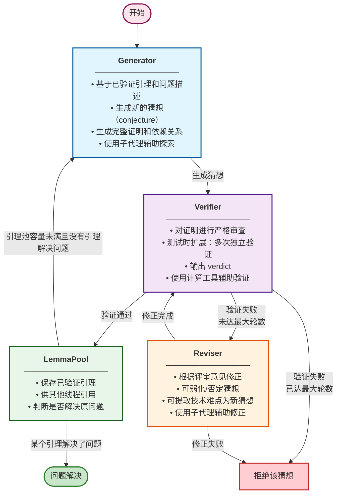

# AlphaSolve

AlphaSolve 是一个基于大语言模型（LLM）的自动化数学定理证明与数学问题求解系统。它采用**生成-验证-修正**的迭代循环，通过多线程并行探索来逐步构建完整的数学证明。

## 核心特性

- **并行探索**：多个工作线程同时独立探索问题，每个线程构建自己的引理链
- **引理池（Lemma Pool）**：已验证的引理被存入共享池，供所有工作线程引用和复用
- **Agentic 验证器**：智能验证器将证明分解为多个步骤，使用计算子代理和符号计算工具进行验证
- **测试时扩展验证**：验证器通过多次独立尝试来提高验证可靠性
- **工具调用支持**：内置 Python、Wolfram 语言执行器和子代理系统
- **多 LLM 提供商支持**：支持 DeepSeek、火山引擎、Moonshot、DashScope、OpenRouter 等

## 系统架构

```
┌─────────────────────────────────────────────────────────────────┐
│                         AlphaSolve                              │
├─────────────────────────────────────────────────────────────────┤
│  ┌─────────────────┐    ┌─────────────────┐    ┌─────────────┐ │
│  │   LemmaWorker   │    │   LemmaWorker   │... │LemmaWorker  │ │
│  │   (线程 1)       │    │   (线程 2)       │    │  (线程 N)    │ │
│  └────────┬────────┘    └────────┬────────┘    └──────┬──────┘ │
│           │                      │                     │        │
│           └──────────────────────┼─────────────────────┘        │
│                                  ▼                              │
│                        ┌─────────────────┐                      │
│                        │    LemmaPool    │                      │
│                        │  (已验证引理池)  │                      │
│                        └─────────────────┘                      │
└─────────────────────────────────────────────────────────────────┘
```

### 工作流程


```mermaid
flowchart TD
    Start([开始]) --> Generator
    
    Generator["<b>Generator</b><br/>───────────────<br/>• 基于已验证引理和问题描述<br/>• 生成新的猜想（conjecture）<br/>• 生成完整证明和依赖关系<br/>• 使用子代理辅助探索"] -->|生成猜想| Verifier
    
    Verifier["<b>Verifier</b><br/>───────────────<br/>• 对证明进行严格审查<br/>• 测试时扩展：多次独立验证<br/>• 输出 verdict<br/>• 使用计算工具辅助验证"] -->|验证通过| LemmaPool
    Verifier -->|验证失败<br/>未达最大轮数| Reviser
    Verifier -->|验证失败<br/>已达最大轮数| Reject[拒绝该猜想]
    
    Reviser["<b>Reviser</b><br/>───────────────<br/>• 根据评审意见修正<br/>• 可弱化/否定猜想<br/>• 可提取技术难点为新猜想<br/>• 使用子代理辅助修正"] -->|修正完成| Verifier
    Reviser -->|修正失败| Reject
    
    LemmaPool["<b>LemmaPool</b><br/>───────────────<br/>• 保存已验证引理<br/>• 供其他线程引用<br/>• 判断是否解决原问题"]
    
    LemmaPool -->|某个引理解决了问题| Solved([问题解决])
    LemmaPool -->|引理池容量未满且没有引理解决问题| Generator
    
    style Generator fill:#e1f5ff,stroke:#01579b,stroke-width:2px
    style Verifier fill:#f3e5f5,stroke:#4a148c,stroke-width:2px
    style Reviser fill:#fff3e0,stroke:#e65100,stroke-width:2px
    style LemmaPool fill:#e8f5e9,stroke:#1b5e20,stroke-width:2px
    style Solved fill:#c8e6c9,stroke:#2e7d32,stroke-width:2px
    style Reject fill:#ffcdd2,stroke:#c62828,stroke-width:2px
    style Start fill:#fce4ec,stroke:#880e4f,stroke-width:2px
```

### 核心组件说明

1. **LemmaWorker（工作线程）**
   - 每个工作线程独立运行，包含 Generator、Verifier、Reviser 三个组件
   - 从 LemmaPool 获取当前已验证的引理作为上下文
   - 生成新的引理并经过验证-修正循环，直到验证通过或达到最大尝试次数

2. **LemmaPool（引理池）**
   - 线程安全的共享存储，保存所有已验证的引理
   - 自动去重（基于引理陈述文本）
   - 持久化存储运行状态

3. **Generator（生成器）**
   - 基于当前已验证引理和问题描述，提出新的猜想（conjecture）
   - 生成完整的证明和依赖关系
   - 使用子代理（proof_subagent、compute_subagent）辅助探索
   - 判断当前引理是否已解决原问题（is_theorem）

4. **Verifier（验证器）**
    - **Agentic 验证**：将证明分解为多个步骤或句子，使用计算子代理逐个验证
    - 对生成的证明进行尽量严格的审查
    - 使用 `VERIFIER_SCALING_FACTOR` 次独立验证（测试时扩展）
    - 检查证明的正确性、完整性和严谨性
    - 使用 `call_compute_subagent` 进行符号计算和反例查找
    - 输出 $\boxed{valid}$ 或 $\boxed{invalid}$ 和verdict

5. **Reviser（修正器）**
   - 根据验证器的反馈修正猜想或证明
   - 支持弱化猜想、否定猜想、提取技术难点为新的子猜想
   - 最多 `MAX_VERIFY_AND_REFINE_ROUND` 次修正尝试

6. **Summarizer（总结器）**
   - 当问题解决时，整理所有依赖的引理和最终定理
   - 生成可读的解决方案报告


## 安装与配置

### 1. 安装依赖

```bash
pip install openai wolframclient
```

### 2. 配置 API 密钥

设置环境变量（根据你使用的 LLM 提供商）：

```bash
# DeepSeek
set DEEPSEEK_API_KEY=your_key

# 火山引擎（字节跳动）
set ARK_API_KEY=your_key

# Moonshot
set MOONSHOT_API_KEY=your_key

# DashScope（阿里云）
set DASHSCOPE_API_KEY=your_key

# OpenRouter
set OPENROUTER_API_KEY=your_key

# LongCat
set LONGCAT_API_KEY=your_key
```

### 3. 配置 Wolfram Engine（可选）

如果启用 Wolfram 工具且未使用默认安装路径，设置环境变量：

```bash
set WOLFRAM_KERNEL=C:\Program Files\Wolfram Research\Wolfram Engine\14.0\WolframKernel.exe
```

### 4. 选择 LLM 模型

编辑 `config/agent_config.py`，配置各组件使用的模型：

```python
# 示例：使用火山引擎的 DeepSeek-V3.2
GENERATOR_CONFIG = {
    **VOLCANO_CONFIG,
    'tools': [PROOF_SUBAGENT_TOOL, COMPUTE_SUBAGENT_TOOL, READ_LEMMA_TOOL, GENERATOR_RESPONSE_FORMAT_REMINDER]
}

VERIFIER_CONFIG = {
    **VOLCANO_CONFIG, 
    'tools': [COMPUTE_SUBAGENT_TOOL, READ_LEMMA_TOOL, READ_CURRENT_CONJECTURE_AGAIN_TOOL]
}

REVISER_CONFIG = {
    **VOLCANO_CONFIG,
    'tools': [PROOF_SUBAGENT_TOOL, COMPUTE_SUBAGENT_TOOL, READ_LEMMA_TOOL, READ_CURRENT_CONJECTURE_AGAIN_TOOL, READ_REVIEW_AGAIN_TOOL, REVISER_RESPONSE_FORMAT_REMINDER]
}
```

支持的预置配置：
- `DEEPSEEK_CONFIG` - DeepSeek 官方 API
- `VOLCANO_CONFIG` - 字节跳动火山引擎
- `MOONSHOT_CONFIG` - Moonshot/Kimi
- `DASHSCOPE_CONFIG` - 阿里云 DashScope
- `LONGCAT_CONFIG` - LongCat
- `OPENROUTER_GPT_5_CONFIG` - OpenRouter GPT-5
- `MIMO_CONFIG` - 小米 MIMO

## 使用方法

### 1. 定义问题

编辑 `problems/problem_1.md`，写入你的数学问题（LaTeX 格式支持）。

### 2. 可选：添加提示

编辑 `hint.md` 添加解题提示或背景知识，在 `main.py` 中取消注释 `hint = load_prompt_from_file('hint.md')` 启用。

### 3. 运行

```bash
# 基本运行（默认 2 个并行线程，1 轮迭代）
python main.py

# 指定参数
python main.py --iteration 2 --batch_size 4 --tool_executor_size 2
```

参数说明：
- `--iteration`：迭代轮数，每轮之间会清理和合并引理池
- `--batch_size`：并行工作线程数（默认为 CPU 核心数 - 2）
- `--tool_executor_size`：工具执行器（Python/Wolfram）的进程池大小
- `--mode`：运行模式，`shared_by_all`（默认）或 `shared_by_iteration`

### 4. 查看结果

- 控制台会输出最终解决方案
- `solution.md` 文件保存完整结果
- `logs/` 目录包含详细运行日志

## 关键配置参数

在 `config/agent_config.py` 的 `AlphaSolveConfig` 类中可调整以下参数：

| 参数 | 默认值 | 说明 |
|------|--------|------|
| `MAX_LEMMA_NUM` | 30 | 最大引理数量限制 |
| `VERIFIER_SCALING_FACTOR` | 15 | 验证器的独立验证尝试次数 |
| `MAX_VERIFY_AND_REFINE_ROUND` | 5 | 单个引理的最大验证-修正轮数 |
| `GENERATOR_MAX_RETRY` | 3 | 生成器解析失败时的重试次数 |
| `REVISER_MAX_RETRY` | 3 | 修正器解析失败时的重试次数 |
| `CHECK_IS_THEOREM_TIMES` | 5 | 判断是否为最终定理的验证次数 |
| `MAX_API_RETRY` | 8 | LLM API 调用失败时的重试次数 |
| `PROOF_SUBAGENT_MAX_DEPTH` | 3 | 证明子代理的最大递归深度 |

## 工具系统

AlphaSolve 为 LLM 提供了多种工具：

### 1. 计算工具
- **`run_python`**：在持久化环境中执行 Python 代码（支持 SymPy、NumPy、SciPy）
- **`run_wolfram`**：执行 Wolfram 语言代码（符号计算、微分方程等）

### 2. 子代理工具
- **`call_proof_subagent`**：纯数学证明子代理（无计算工具）
- **`call_compute_subagent`**：计算子代理（可使用 Python/Wolfram）

### 3. 辅助工具
- **`read_lemma`**：读取已验证引理的完整证明
- **`read_current_conjecture_again`**：重新读取当前猜想
- **`read_review_again`**：重新读取验证器的评审意见